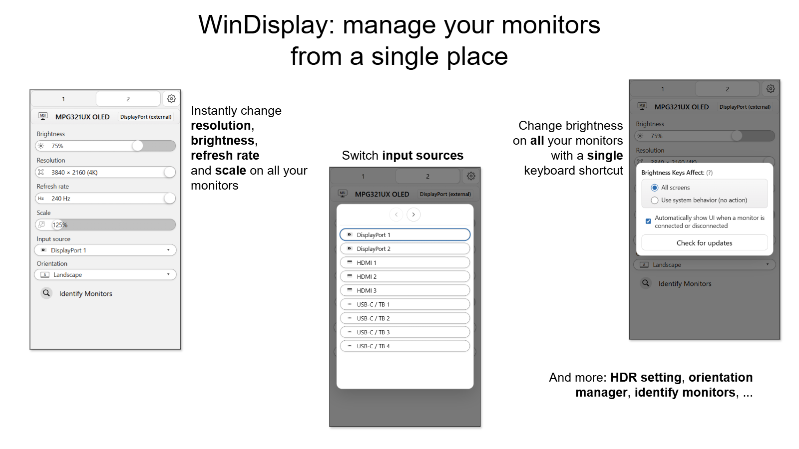

## WinDisplay

  
  

Like BetterDisplay, but for Windows.

- Change resolution and refresh rate of your monitors from your system tray.
- Change monitor brightness
- Change monitor orientation
- Enable and disable HDR
- Change scale without logging out
- Change input source

More functions coming!

## Installation

Download latest executable from [the release page](https://github.com/zpix1/windisplay/releases/latest).

## CLI Usage

For CLI usage instructions, see [CLI_USAGE.md](CLI_USAGE.md).

## Contributors

- [zpix1](https://github.com/zpix1) - Ivan Baksheev
- [exSnake](https://github.com/exSnake)
