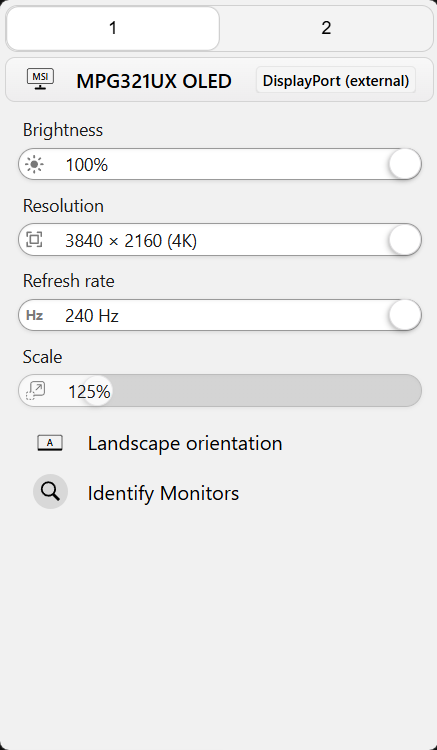

## WinDisplay

Like BetterDisplay, but for Windows.

- Change resolution and refresh rate of your monitors from your system tray.
- Change monitor brightness
- Change monitor orientation

More functions coming!

## Installation

Download latest executable from [the release page](https://github.com/zpix1/windisplay/releases/latest).
